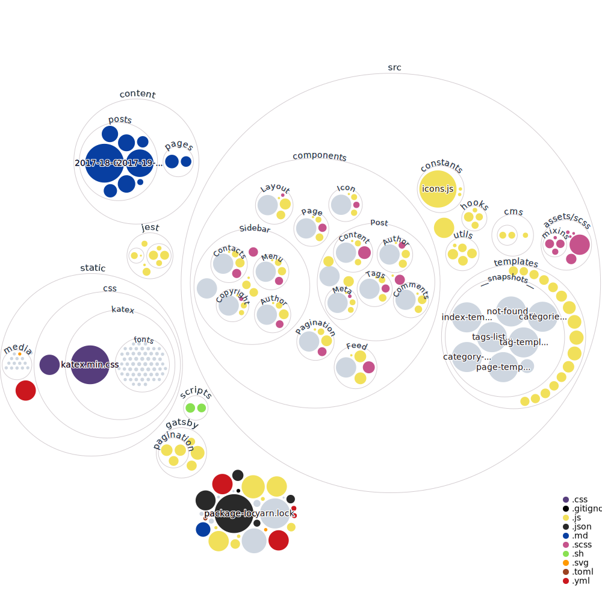

#### URL
https://bboy114crew.github.io/blog/

#### Visualization of the codebase


#### Start Developing

Navigate into your new site’s directory and start it up.

```sh
cd blog
gatsby develop
```

#### Open the source code and start editing!

Your site is now running at `http://localhost:8000`!

Note: You'll also see a second link: `http://localhost:8000/___graphql`. This is a tool you can use to experiment with querying your data. Learn more about using this tool in the [Gatsby tutorial](https://www.gatsbyjs.org/tutorial/part-five/#introducing-graphiql).

Open the `blog` directory in your code editor of choice and edit `src/templates/index-template.js`. Save your changes and the browser will update in real time!

## Deploy to Github Pages

To deploy to github pages, simply do the following:

- Ensure that your `package.json` file correctly reflects where this repo lives
- Change the `pathPrefix` in your `config.js`
- Run the standard deploy command

```sh
npm run deploy
```


#### Access Locally
```
$ git clone https://github.com/[GITHUB_USERNAME]/[REPO_NAME].git
$ cd [REPO_NAME]
$ yarn
$ npm run develop
```
To test the CMS locally, you'll need run a production build of the site:
```
$ npm run build
$ gatsby serve
```

## Folder Structure

```
└── content
    ├── pages
    └── posts
└── static
    ├── admin
    └── media
└── src
    ├── assets
    │   └── scss
    │       ├── base
    │       └── mixins
    ├── cms
    │   └── preview-templates
    ├── components
    │   ├── Feed
    │   ├── Icon
    │   ├── Layout
    │   ├── Page
    │   ├── Pagination
    │   ├── Post
    │   │   ├── Author
    │   │   ├── Comments
    │   │   ├── Content
    │   │   ├── Meta
    │   │   └── Tags
    │   └── Sidebar
    │       ├── Author
    │       ├── Contacts
    │       ├── Copyright
    │       └── Menu
    ├── constants
    ├── templates
    └── utils

```
